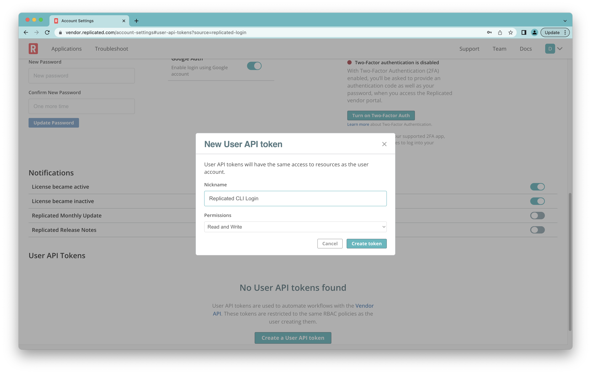
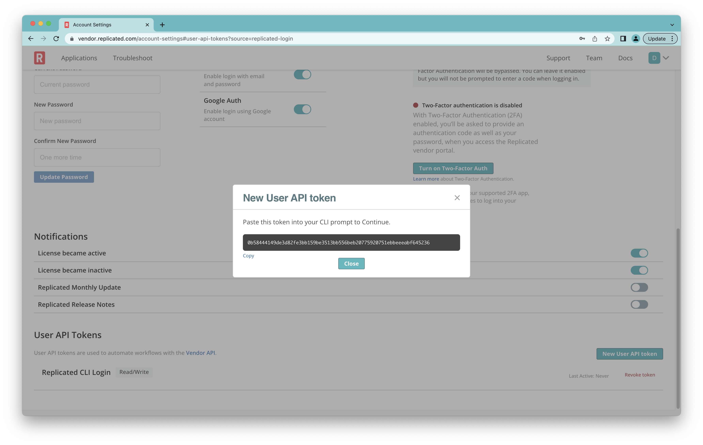

<!-- 
Replicated CLI / Foundation Onboarding
performed in the style of Hans Ørberg 
or perhaps Matthias Felleisen 
-->

<!-- run -->
```shell
$ replicated login
```

<!-- output -->
```text
Replicated will request an API token for vendor.replicated.com using your browser.

If login is successful, Replicated will store the token in plain text in
the following file for use by subsequent commands:
    /Users/dex/.replicated.d/credentials.yaml

Do you want to proceed?
  Only 'yes' will be accepted to confirm.

  Enter a value: yes

```





<!-- output -->
```text
---------------------------------------------------------------------------------

Replicated must now open a web browser to the tokens page for vendor.replicated.com.

If a browser does not open this automatically, open the following URL to proceed:

    https://vendor.replicated.com/account-settings#user-api-tokens?source=replicated-login

---------------------------------------------------------------------------------

Generate a token using your browser, and copy-paste it into this prompt.

Terraform will store the token in plain text in the following file
for use by subsequent commands:
    /Users/dex/.replicated.d/credentials.yaml

Token for vendor.replicated.com
  Enter a value: 🔑

Retrieved token for user *dexter@replicated.com*

---------------------------------------------------------------------------------

Welcome to Replicated! To get started, 


  1. Check out the guide at https://github.com/replicatedhq/replicated/blob/main/doc/psi.md
  2. Explore our docs at https://docs.replicated.com
```
* * * 

<!-- run -->
<!-- app basics - note that the `SCHEDULER` column has been removed --> 
```shell
$ replicated app create app-${RANDOM}
```

<!-- output -->
```
ID                             NAME        SLUG    
2Nq4Mpz1A1qAbs084grmfb4J9yQ    app-8008    app-8008

---------------------------------------------------------------------------------

Created skeleton helm application in ./app-8008

In the future, to bootstrap an application with an existing helm chart, run:

    replicated app create NAME --directory=path/to/chart

```
* * * 

<!-- run -->
```shell
$ export REPLICATED_APP=${USER}-test
```

<!-- 

Give a path to a directory to create. In this case we'll bootstrap an app similar to the default nginx chart, or maybe use a library chart?

Later in the guide, we'll teach you to bootstrap with your own chart
-->
<!-- run -->
```shell
$ replicated app create ${REPLICATED_APP} 
```

<!-- output -->
```text
ID                             NAME        SLUG        
2Nq1CRcBFSb5h9nUB3lWKGQEDfv    dex-test    dex-test

---------------------------------------------------------------------------------

Created skeleton helm application in ./dex-test

In the future, to bootstrap an application with an existing helm chart, run:

    replicated app create ${REPLICATED_APP} --directory=path/to/existing/chart
```

* * *

<!-- run -->
```shell
$ ls ${REPLICATED_APP}
```

<!-- output -->
```
Chart.yaml  charts  templates  values.yaml
```

* * *

```shell
$ export CUSTOMER_NAME=${USER}-dev
```
<!-- run -->
```shell
$ replicated customer create ${CUSTOMER_NAME}
```

<!-- output -->
```
ID                             NAME       CHANNELS     EXPIRES    TYPE
2NqTPfQj9xkVypvUYwpNW8T0scH    dex-dev     Unstable    Never      dev
```
